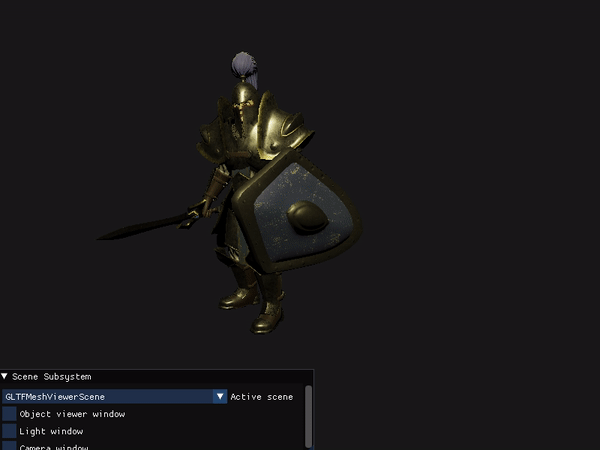
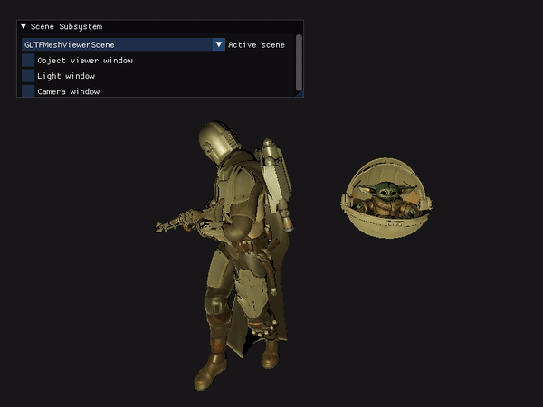
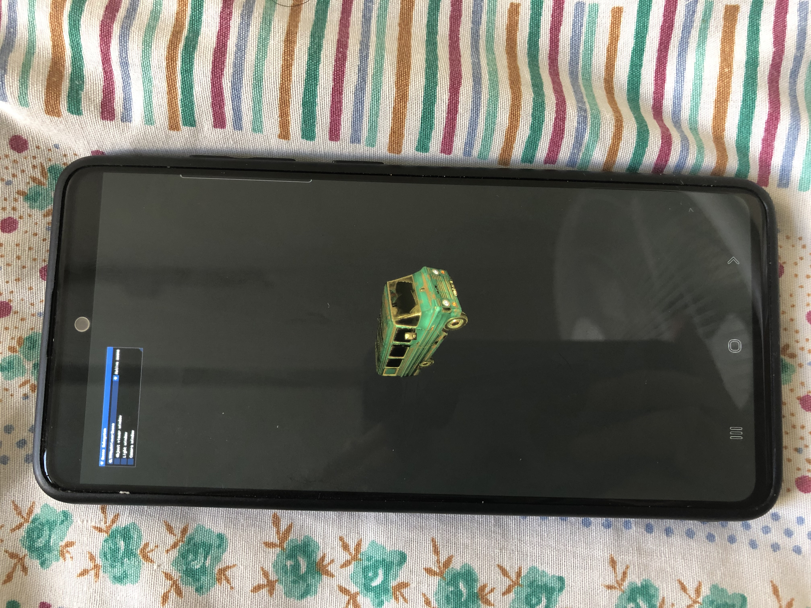
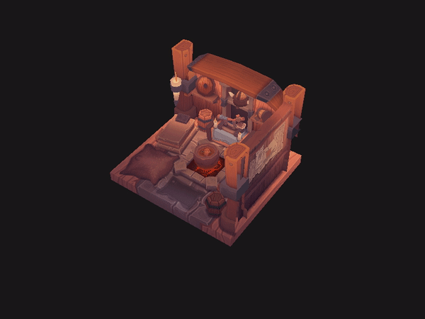
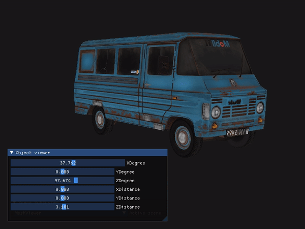
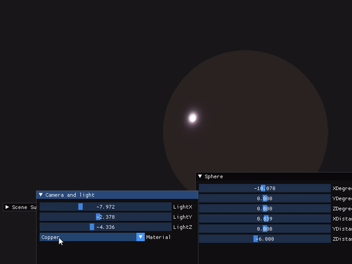
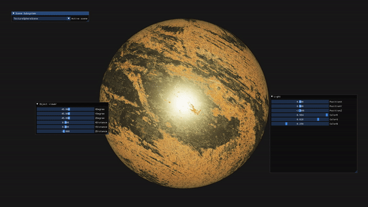
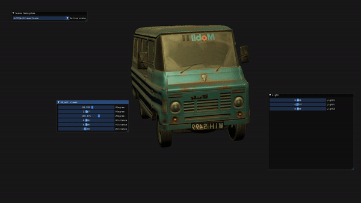
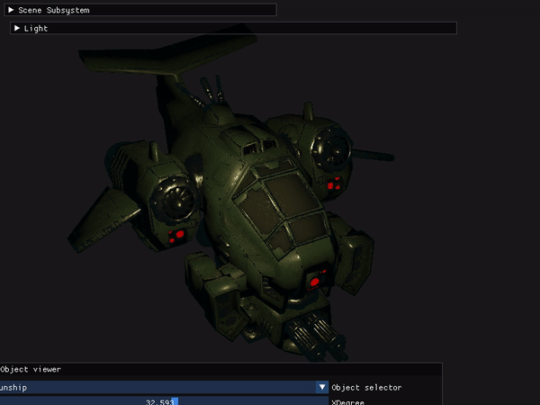
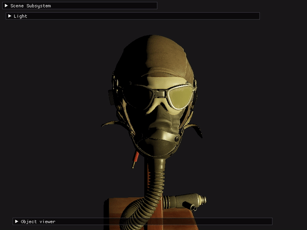

# Vulkan engine :))
### Features preview and some document coming soon!

<br/>

## How to build
### Windows
```
Create directory build64
cmake . -BBuild64 -DCMAKE_GENERATOR=x64
Or 86 if you prefer (ASan does not work on x64 currently)
cmake .. -G "Visual Studio 16 2019" -A Win32
```
Find .sln files inside build64 and then run the project
<br/>

### Macos
```
mkdir build64
cd build64
cmake ..
make
./MFaEngine
```
<br/>

### Linux
Not supported yet!
<br/>

### Android (Experimental)
```
Open android folder using android studio. You might need to change ndk version based on your installed version
```
<br/>

### IOS
Not supported yet!
<br/>

## Animation Time!




<br>

## Experimental android port



## .obj file:


<br>

## .gltf file:


<br>

## Basic PRB


<br>

## PBR on textured sphere


<br>

## PBR on GLTF models


<br>

## Support for rendering scene from gltf node tree



<br>

## Sponza scene
