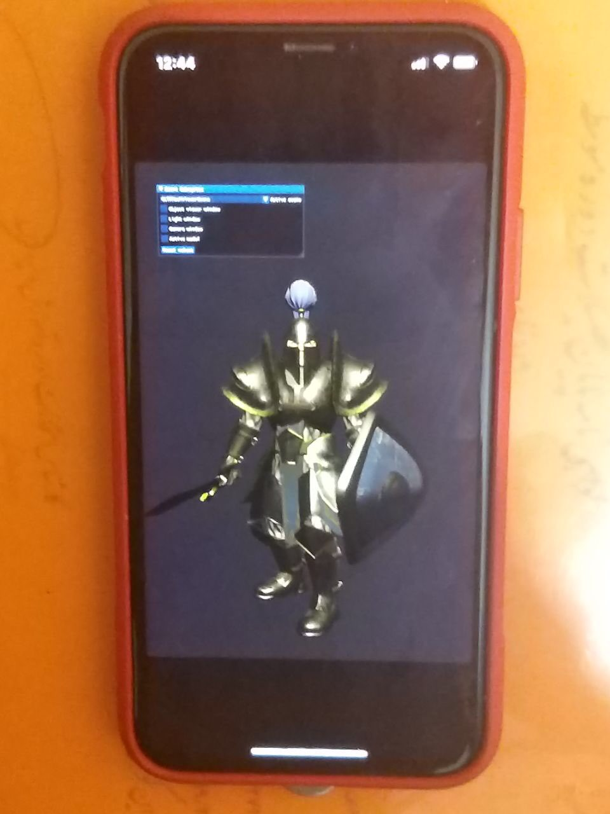

# MFA engine :))

## Animation explanation
<a href="./document/Animation.md">Read more about my animation implementation here</a>

<br/>

More document/tutorial will be added soon!

## Particle system


Particles are simulated using compute shader

<br>


<br>

## Character control


<br>

## Shadow mapping


<br>

## Animation Time!


<br>

## PBR on GLTF models


<br>

## Support for rendering scene from gltf node tree


<br>

## Sponza scene


<br>

## Experimental android port


<br>

## Experimental ios port



<br>

## .obj file:


<br>

## .gltf file:


<br>

## Basic PRB


<br>

## PBR on textured sphere


<br>


## How to build
### Windows
- You can use following command to create the project
```
mkdir build64 || cmake -A x64 -S . -Bbuild64
```
- Or if you have node installed you can run ```npm run cmake-windows```
- Also you can use cmake tools that does everything for you (Available as extension for VS-Code)
- Find .sln files inside build64 and then run the project
<br/>

### Note: 
Currently most of recent examples won't run on mac because of no geometry shader support. I'm trying to use compute shader for animation, particle and replace all geometry shader usages with compute shader

### Macos
- Using make
```
mkdir build64
cd build64
cmake .. -DCMAKE_BUILD_TYPE=Debug (Release) Or you can use npm run cmake-mac
make
./MFaEngine
```

- If you prefer Xcode, create a build folder then execute following command from inside that folder:
```
cmake .. -G Xcode -DCMAKE_TOOLCHAIN_FILE=./ios.toolchain.cmake -DPLATFORM=MAC
```

<br/>

### Linux

Not complete yet!

```
mkdir build
cd build
cmake ..

```

For debug build
```
cmake -DDEBUG_MODE=ON ..
```

For release build
```
No extra flag needed
```
<br/>

### Android (Experimental)
```
Open android folder using android studio. You might need to change ndk version based on your installed version
```
<br/>

### IOS (Experimental)
```
cmake .. -G Xcode -DCMAKE_TOOLCHAIN_FILE=./ios.toolchain.cmake -DPLATFORM=OS64COMBINED
```
<br/>

